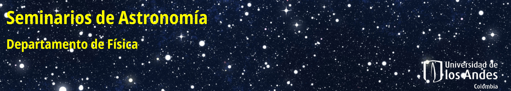

Bienvenidos a la página de los seminarios de Astronomía que tienen lugar en el Departamento de Física de la Universidad de los Andes, Bogotá-Colombia.

# Histórico de Seminarios

### Martes Mar-02-2021:
- **Maria Gracia Batista** (Observatorio Astronómico, Universidad de los Andes). **Avances en las medidas de actividad de estrellas jóvenes en el Complejo molecular de Orión.**

*La actividad en las atmósferas estelares se puede evidenciar por la presencia de ciertas líneas espectrales. Durante la etapa de secuencia principal se sabe que la cantidad de actividad depende de la edad de las estrellas, pero la caracterización de este comportamiento en las primeras etapas de su formación es un tema que aún sigue abierto. En esta charla compartiré los avances en las medidas de actividad de un grupo de casi 1800 estrellas que están en el Complejo de formación estelar de Orión.* [Vea la presentación.](presentaciones/)

- **Daniel Alejandro Molano Moreno** (Estudiante, Universidad de los Andes). **Teoría Post Einstein.** 

*Argumentos teóricos y observacionales abren la posibilidad de que la Relatividad General (RG) no sea la ultima teoría gravitacional. Esto ha motivado toda una serie de alternativas en su mayoría generalizaciones de la RG como teorías escalar-tensor, tensor-vector-scalar, y teorias de derivadas de orden superior como teorías de gravedad modificada f(R). Por otro lado la dificultad de tener soluciones analíticas exactas de las ecuaciones diferenciales en estas teorias no nos permiten tener una vision global clara de lo que podrían predecir estas alternativas y como compararlas con RG. En nuestro trabajo usamos técnicas perturbativas en campos tensoriales, para demostrar que las soluciones en RG en el vacio estan desconectadas matemáticamente con las soluciones en f(R) en el vacío. Discutiremos algunas implicaciones físicas y aspectos matemáticos importantes de este resultado.* [Vea la presentación.](presentaciones/)

### Martes Feb-23-2021:
- **Milo Buitrago-Casas** (Estudiante, Universidad de Berkeley).  **Nuevas tecnologías para el estudio del Sol en altas energías.**

*El estudio en altas energías del Sol revela las ubicaciones de liberación de energía y aceleración de partículas. En ninguna parte esta liberación de energía es más dramática que en los eventos de erupción solar (erupciones solares y eyecciones de masa coronal), en las que grandes cantidades de energía se convierten en partículas aceleradas y radiación. Esta radiación, si se dirige hacia la Tierra, podría representar un peligro para los satélites, los astronautas y las redes eléctricas para los eventos más grandes. En el pasado, los estudios de alta energía de estos procesos tenían que depender de métodos indirectos, esto es, técnicas de imágenes basadas en análisis tipo Fourier para rayos X duros y rayos gamma. En la actualidad, el advenimiento de la tecnología de enfoque directo para rayos X duros promete revolucionar el estudio de altas energías en el Sol. La óptica de rayos X duros de enfoque directo ha demostrado resultados exitosos en cohetes y globos sub-orbitales, y en el telescopio espacial NuSTAR. Esta charla dará una visión general del interés científico en el estudio de eventos eruptivos solares a altas energías y revisará los esfuerzos de instrumentación de enfoque hasta ahora, con énfasis en el desarrollo y vuelos del cohete FOXSI y los planes existentes para la co-observación de una erupción solar en conjunto con la sonda espacial Parker.* [Vea la presentación.](presentaciones/)

- **Fredy Alexander Orjuela Lopez** (Estudiante, Universidad de los Andes). **Análisis de los parámetros en estrellas Be.**

*Las estrellas  Be están acompañadas de un disco circunenstelar, lo que hace que  estas estrellas sean el escenario perfecto para entender la dinámica de lo que se conocen como discos de decreción. En esta charla de seminario, se presentan los parámetros óptimos que acompañan a los modelos que describen la dinámica de los discos circunenstelares a partir de un enfoque Bayesiano.* [Vea la presentación.](presentaciones/)

- **Nicolás Garavito** (Estudiante, Universidad de Arizona).  **La Vía Láctea y la gran Nube de Magallanes.**

*La gran nube de Magallanes, la galaxia satélite más grande de la Vía Láctea, entró recientemente a la Vía Láctea. Como resultado de esta interacción la Vía Láctea se encuentra en desequilibrio dinámico.  Aunque este estado de desequilibrio es un reto para modelar la Vía Láctea, también es una oportunidad para estudiar la naturaleza de la materia oscura. En esta charla resumiré cómo podemos modelar la Vía Láctea en presencia de la gran nube de Magallanes y cómo podemos aprender sobre la naturaleza de la materia oscura.* [Vea la presentación.](presentaciones/)

  
### Martes Feb-16-2021:
- **Steven Alfonso** (Estudiante, Universidad de los Andes). **Open clusters with Gaia DR2.**

*En esta charla presentaré una descripción general sobre la pertenencia de estrellas con los movimientos propios del Gaia DR2 sobre los cúmulos abiertos de las Pléyades, Blanco 1 y Beehive. De acuerdo a los resultados obtenidos, se mostrarán algunas dificultades que se han presentado al identificar estrellas en los diagramas color-magnitud, principalmente aquellas que se encuentran fuera de la secuencia principal pero están inmersas en la distribución espacial del cúmulo abierto.* [Vea la presentación.](presentaciones/SAlfonso20211602.pdf)

- **Cesar Dagoberto Millan Valderrama** (Estudiante, Universidad de los Andes). **Estudio óptico del sistema binario de rayos X Swift J0243.6+6124.**

*El sistema binario Swift J0243.6+6124 detectado en 2017 es clasificado como la única fuente de rayos X ultra luminosa en nuestra galaxia. Esta charla se basará en el artículo de P. Reig et al. (2020) “Optical counterpart to Swift J0243.6+6124”, trabajo que se encuentra entre los primeros estudios del óptico en datos espectroscópicos y fotométricos de este sistema.* [Vea la presentación.](presentaciones/)

  
### Martes Feb-09-2021:
- **Jaime Ernesto Forero Romero** (Profesor, Universidad de los Andes). **Ayudando desde Uniandes a construir el mapa más grande del Universo.**

*En esta charla presentaré al Dark Energy Spectroscopic Instrument (DESI), un proyecto del cual hace parte Uniandes  y que tiene como objetivo hacer el mapa más grande del Universo. Hablaré de los retos técnicos, del papel de Uniandes en la colaboración y del progreso actual de las observaciones que empezaron en Diciembre 2020 y que se extenderán hasta el 2025.* [Vea la presentación.](presentaciones/JForero20210902.pdf)

- **John Fredy Suarez Perez** (Estudiante, Universidad de los Andes). **Assessing the quality of DESI spectra.**

*Measuring the spectra of astronomical objects has three main steps: gathering the astronomical light of the object of interest in the telescope, passing the light through the spectrograph and recording the dispersed light on a CCD. Afterward, all these data have to be processed to obtain a final calibrated spectrum. Every step in this process is open to instrumental or algorithmic errors. Due to the large amount of data to be obtained by DESI, human inspection to identify these errors could be inefficient.  To solve this task we want to use the UMAP algorithm. We take a set of observed spectra to embed it into 2D space using UMAP. The calibration errors and bad spectra appear in the low dimensional representation as outliers. In this talk I will show preliminary results from this approach.* [Vea la presentación.](presentaciones/JSuarez20210902.pdf)

  
### Martes Feb-02-2021: 
  
- **Benjamin Oostra Vannoppen** (Profesor, Universidad de los Andes). **Granulación en estrellas tipo K.**
  
*Al medir la velocidad de una estrella, surge un problema: cada línea espectral indica una velocidad diferente. Esto se debe a movimientos convectivos en su fotosfera, fenómeno conocido como granulación, y al hecho de que cada línea espectral se forma preferiblemente en una zona diferente. En el Sol esta complicación ha sido ampliamente estudiada; pero en estrellas frías, sobre todo gigantes, el problema es más complejo.* [Vea la presentación.](presentaciones/BOostra20210202.pdf)

- **Javier Alejandro Acevedo Barroso** (Estudiante, Universidad de los Andes). **Searching for extragalactic variable stars using Machine Learning algorithms.**
  
*El objetivo de este proyecto es encontrar estrellas variables en la galaxia NGC55 usando treinta imágenes de campo amplio tomadas para el Proyecto Araucaria con el telescopio de 2.2m MPG/ESO en el observatorio de La Silla, Chile, entre 2003 y 2006. Se entrenaron clasificadores de estrellas variables usando algoritmos de machine learning como bosques aleatorios y máquinas de soporte vectorial. Como muestras de entrenamiento se usaron los catálogos de estrellas variables de OGLE III y OGLE IV. Al final, se detectaron 150 estrellas variables, incluidas 81 de las 144 cefeidas reportadas por el Proyecto Araucaria para la galaxia NGC 55.* [Vea la presentación.](presentaciones/JAcevedo_20210202_r2.pdf)

